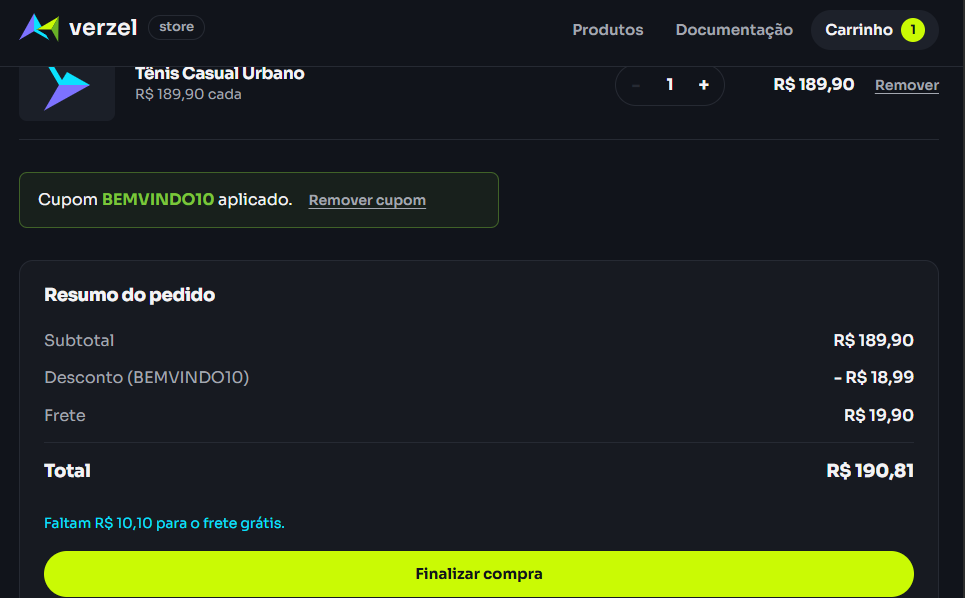
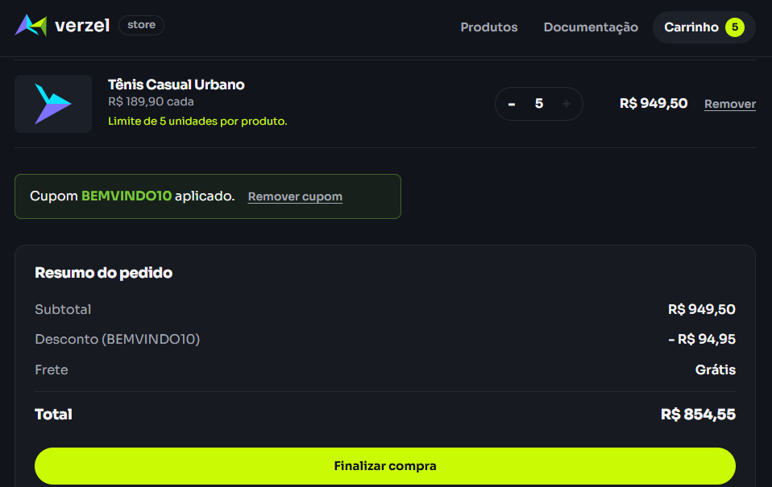
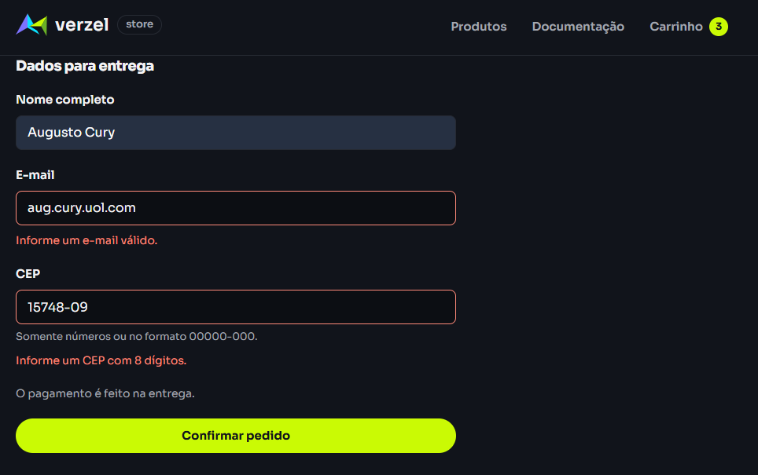

# Relatório de Execução e Evidências de Testes Manuais

Este documento registra a execução prática dos cenários de teste mapeados na Verzel Store, contendo a matriz de rastreabilidade, status de execução e evidências visuais coletadas.

---

## 1. Matriz de Rastreabilidade e Status de Execução

| ID | Critério de Aceite | Cenário de Teste | Status | Evidência |
| :--- | :--- | :--- | :---: | :--- |
| **CT-01** | CA01, CA09 | Aplicação bem-sucedida de cupom válido | **PASS** | `evidencia-ca01-ca02-cupom-sucesso.png` |
| **CT-02** | CA02 | Insensibilidade a caixa e remoção de espaços (trimming) | **PASS** | `evidencia-ca01-ca02-cupom-sucesso.png` |
| **CT-03** | CA06, CA08, CA10 | Limite de 5 unidades, Frete Grátis e Desconto Cumulativo | **PASS** | `evidencia-ca06-ca08-ca10-limite-e-frete-gratis.png` |
| **CT-04** | CA07 | Análise de Valor Limite abaixo de R$ 200,00 (Frete R$ 19,90) | **PASS** | `evidencia-ca07-limite-frete-pago.png` |
| **CT-05** | CA03, CA04 | Cupons inválidos ou expirados | **PASS** | `evidencia-ca03-ca04-cupons-invalidos.png` |
| **CT-06** | CA08 | Preservação do Frete Grátis com desconto líquido abaixo de R$ 200 | **PASS** | `evidencia-ca08-cupom-abaixo-200.png` |
| **CT-07** | Regras de Checkout | Validação e bloqueio de campos obrigatórios e formatos inválidos | **PASS** | `evidencia-checkout-validacao-campos.png` |

---

## 2. Galeria de Evidências

### CT-01 e CT-02: Aplicação de Cupom Válido com Trimming

### CT-03: Limite Máximo de 5 Unidades e Recálculo do Frete Grátis

### CT-07: Validação de Campos no Formato do Checkout

---

## 3. Resumo da Cobertura

* **Total de Cenários Executados:** 7
* **Taxa de Sucesso (Pass Rate):** 100%
* **Ambiente de Testes:** Web (Google Chrome / Chromium)