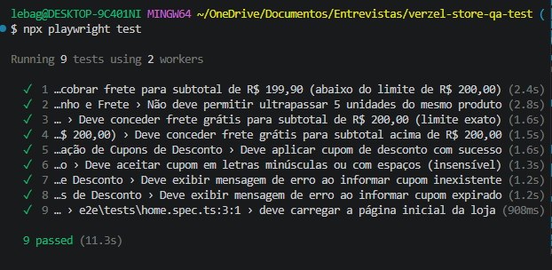
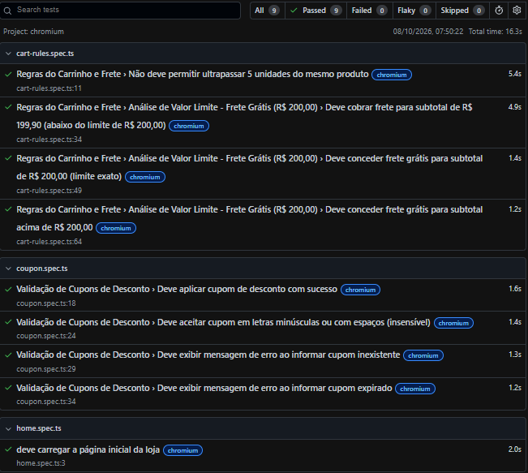
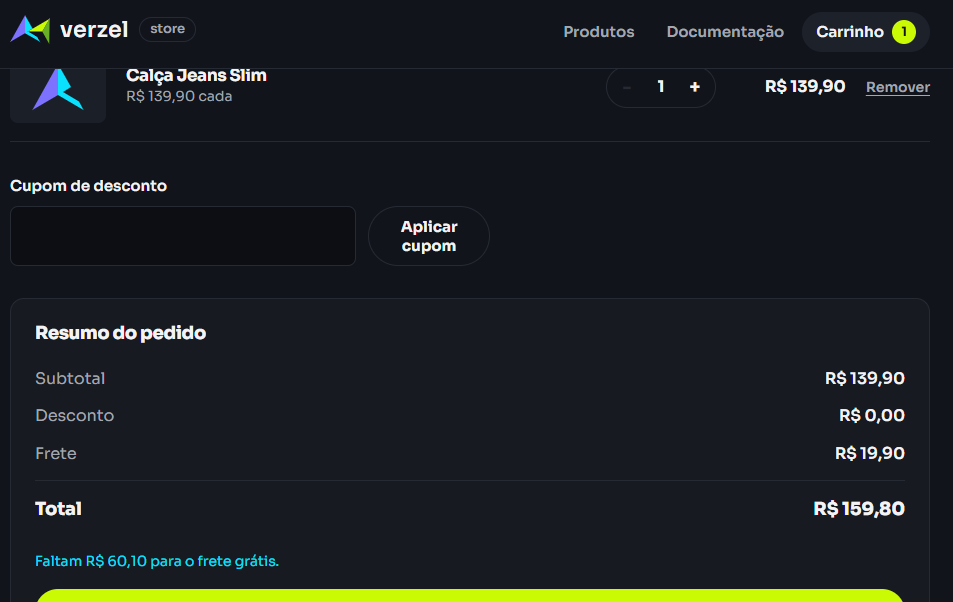
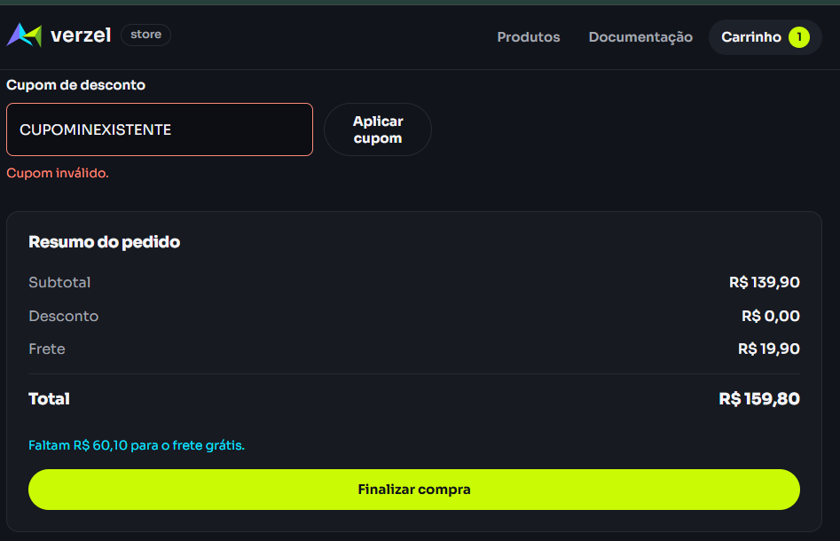
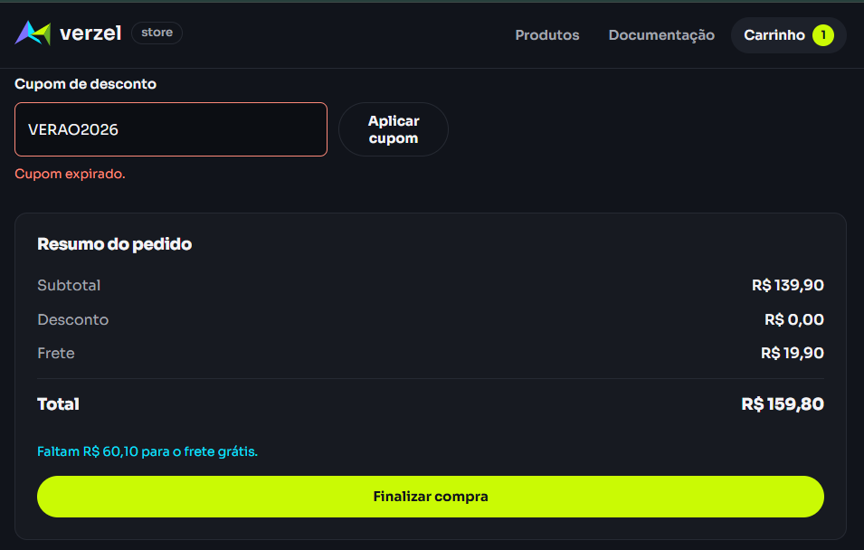
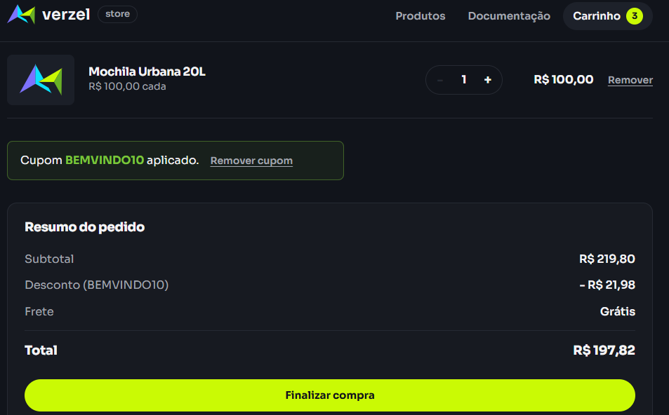

# Relatório de Execução e Evidências de Testes

Este documento registra a execução prática dos cenários de teste mapeados na Verzel Store, contendo a matriz de rastreabilidade, status de execução e evidências visuais coletadas — cobrindo testes manuais, exploratórios e automatizados (E2E).

---

## 1. Matriz de Rastreabilidade e Status de Execução (Testes Manuais)

| ID | Critério de Aceite | Cenário de Teste | Status | Evidência |
| :--- | :--- | :--- | :---: | :--- |
| **CT-01** | CA01, CA09 | Aplicação bem-sucedida de cupom válido | **PASS** | `evidencia-ca01-ca02-cupom-sucesso.png` |
| **CT-02** | CA02 | Insensibilidade a caixa e remoção de espaços (trimming) | **PASS** | `evidencia-ca01-ca02-cupom-sucesso.png` |
| **CT-03** | CA06, CA08, CA10 | Limite de 5 unidades, Frete Grátis e Desconto Cumulativo | **PASS** | `evidencia-ca06-ca08-ca10-limite-e-frete-gratis.png` |
| **CT-04** | CA07 | Análise de Valor Limite abaixo de R$ 200,00 (Frete R$ 19,90) | **PASS** | `evidencia-ca07-limite-frete-pago.png` |
| **CT-05** | CA03, CA04 | Cupons inválidos ou expirados | **PASS** | `evidencia-ca03-cupom-invalido.png`, `evidencia-ca04-cupom-expirado.png` |
| **CT-06** | CA08 | Preservação do Frete Grátis com desconto líquido abaixo de R$ 200 | **PASS** | `evidencia-ca08-cupom-abaixo-200.png` |
| **CT-07** | Regras de Checkout | Validação e bloqueio de campos obrigatórios e formatos inválidos | **PASS** | `evidencia-checkout-validacao-campos.png` |

---

## 2. Testes Exploratórios

Além dos cenários roteirizados, foi conduzida uma sessão de teste exploratório (charter livre), buscando comportamentos não previstos na documentação formal.

| # | O que foi tentado | Resultado observado |
| :--- | :--- | :--- |
| E-01 | Inserção de cupom com caracteres especiais e emojis | Sistema rejeitou corretamente, exibindo mensagem de cupom inválido |
| E-02 | Duplo clique rápido e repetido no botão de incremento de quantidade | Incremento ocorreu normalmente até o limite de 5 unidades; o bloqueio no limite máximo funcionou mesmo sob cliques rápidos, sem duplicar ou ultrapassar a quantidade |
| E-03 | Atualização da página (F5) com o carrinho preenchido | Os itens do carrinho foram mantidos corretamente após o reload |
| E-04 | Uso do botão "voltar" do navegador durante a navegação | Sistema respondeu normalmente, retornando à tela anterior sem erros ou perda de estado |
| E-05 | Campos obrigatórios do formulário de checkout preenchidos apenas com espaços em branco | Sistema identificou o campo como inválido e exibiu a recomendação de preenchimento correto |

**Conclusão:** Nenhum comportamento divergente ou defeito foi identificado durante a sessão exploratória. O sistema se manteve estável e consistente mesmo sob interações fora do fluxo padrão documentado.

---

## 3. Execução da Suíte Automatizada (E2E - Playwright)

A suíte de testes end-to-end foi automatizada com Playwright + TypeScript, cobrindo os cenários de cupom, regras de frete/limite de unidades e carregamento da aplicação.

**Comando executado:** `npx playwright test`

**Resultado:**

Running 9 tests using 2 workers

✓ 1 …cobrar frete para subtotal de R$ 199,90 (abaixo do limite de R$ 200,00) (2.4s)
✓ 2 …Não deve permitir ultrapassar 5 unidades do mesmo produto (2.8s)
✓ 3 …Deve conceder frete grátis para subtotal de R$ 200,00 (limite exato) (1.6s)
✓ 4 …Deve conceder frete grátis para subtotal acima de R$ 200,00 (1.5s)
✓ 5 …Deve aplicar cupom de desconto com sucesso (1.6s)
✓ 6 …Deve aceitar cupom em letras minúsculas ou com espaços (insensível) (1.3s)
✓ 7 …Deve exibir mensagem de erro ao informar cupom inexistente (1.2s)
✓ 8 …Deve exibir mensagem de erro ao informar cupom expirado (1.2s)
✓ 9 …deve carregar a página inicial da loja (908ms)

9 passed (11.3s)

**Taxa de Sucesso:** 100% (9/9 cenários automatizados aprovados)

---

## 4. Galeria de Evidências

### CT-01 e CT-02: Aplicação de Cupom Válido com Trimming

### CT-03: Limite Máximo de 5 Unidades e Recálculo do Frete Grátis

### CT-04: Análise de Valor Limite abaixo de R$ 200,00

### CT-05: Cupons Inválidos ou Expirados

### CT-06: Preservação do Frete Grátis com Desconto Líquido

### CT-07: Validação de Campos no Formato do Checkout

---

## 5. Resumo da Cobertura

| Tipo de Teste | Cenários | Resultado |
| :--- | :---: | :---: |
| Manual (roteirizado) | 7 | 100% PASS |
| Exploratório (não roteirizado) | 5 | Sem defeitos encontrados |
| Automatizado (E2E - Playwright) | 9 | 100% PASS |

* **Total de Cenários Executados:** 21 (7 manuais + 5 exploratórios + 9 automatizados)
* **Taxa de Sucesso Geral:** 100%
* **Ambiente de Testes:** Web (Google Chrome / Chromium)